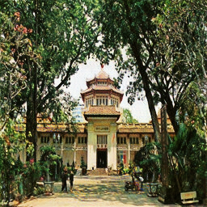
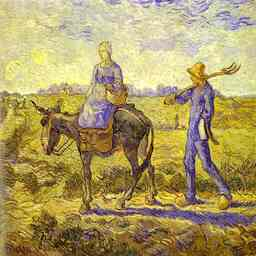
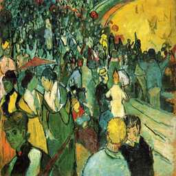
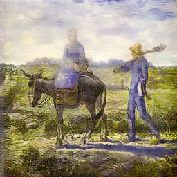
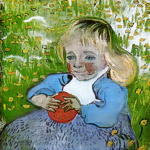
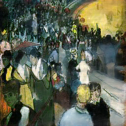

# CycleGAN tensorflow2

`tensorflow2`实现`CycleGAN`，移植修改自[源码](https://github.com/Monkeone/tensorflow2cyclegan)

## 效果演示(只训练30000次)
- 风景画转梵高画风格:
  输入风景画:
  
  
  转换后:
  
  
- 梵高画转风景画风格：
  输入梵高画:
  
  
  转换后:
  
  
更多次数的训练效果应该还会更好一些。

### 移植细节
程序主体架构来自`Monkeone`，原作者可能是完全复现`CycleGAN`论文的算法与网络架构，我为了在小显存显卡上方便训练以及更好的网络效果，主要做了如下修改:
1. 修改生成器，使用上采样层代替转置卷积
2. 减小默认`resnet blocks`和`判别器`隐层数量，方便小显存显卡训练
3. 网络输入大小由`helper`里`cfg`提供
4. 添加`tensorboard`记录训练时的图片
5. 修复一处可能存在的`判别器`优化器bug
6. 添加更多命令行参数，可直接指定学习率、恢复训练等
7. 重写`helpers.py`
8. 修改训练、测试逻辑


### TODO
1. 完成更多模型的训练，提供更多的演示效果与内置模型
2. ...

### 准备数据集

准备两种不同风格或领域的图片，分为`A`和`B`，按如下方式放在`data`文件夹下：在`data`文件夹下新建文件夹，用存放在`trainA`、`trainB`、`testA`、`testB`文件夹，其中`train`内图片用于训练模型，`test`内图片用于最后的转换测试，

### 训练
- 执行`python train.py -h` 查看帮助信息，一般执行如下命令即可开始训练：
```
python train.py --data_dir 数据集路径
```
- 使用`tensorboard`查看训练状态：
```
tensorboard --logdir logs/ --bind_all
```
浏览器打开`http://127.0.0.1:6006`
    
- 如需在训练时查看生成图片信息，在训练时指定`--tensorboard_images_freq`参数，参数为更新频率
    
### 测试
- 执行`python test.py -h` 查看帮助信息，一般执行如下命令即可开始测试：
```
python test.py --data_dir 数据集路径
```
- 测试结果默认保存在数据集目录下`output`文件夹里，也可使用`out_dir`参数指定保存路径


### Credits
- [Monkeone](https://github.com/Monkeone/tensorflow2cyclegan).

